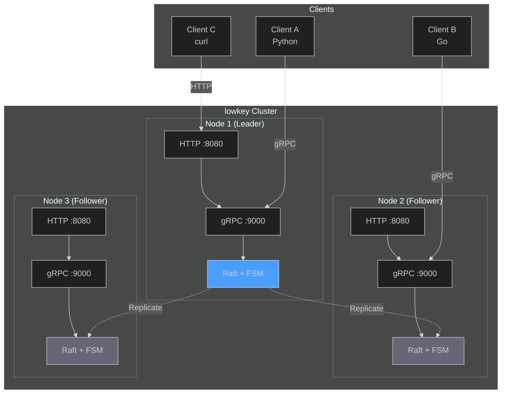
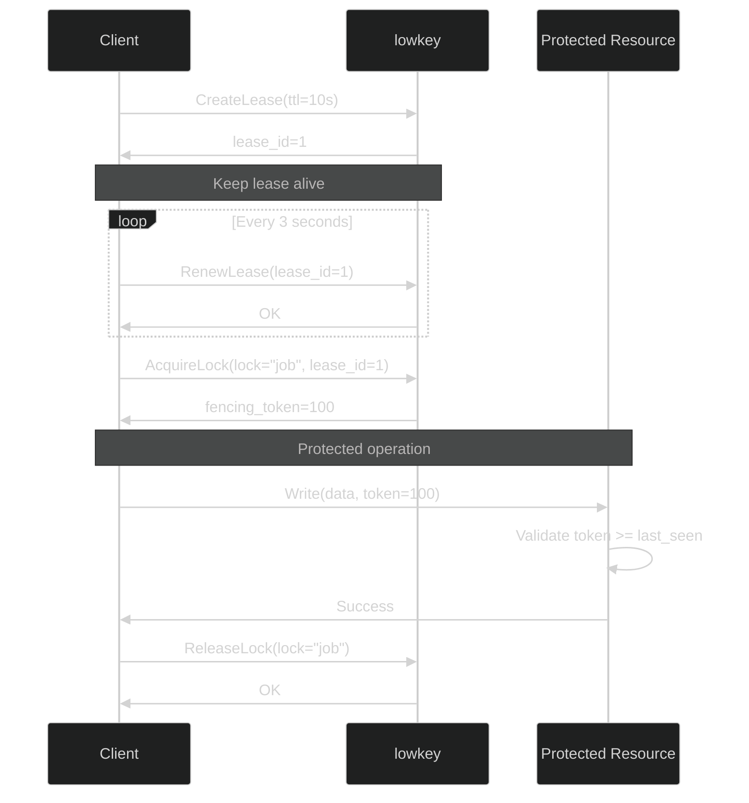
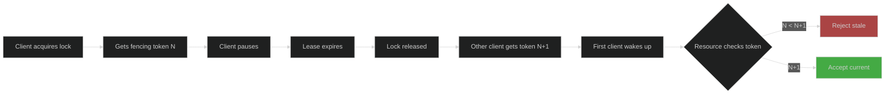

# lowkey

> A distributed lock service built on Raft consensus - simple, correct, and production-ready.

**lowkey** provides distributed locks with fencing tokens to prevent split-brain scenarios. Built on [Raft consensus](https://raft.github.io/), it guarantees strong consistency and handles network partitions gracefully.

## Features

- **Distributed Locks** - Mutual exclusion across multiple machines
- **Fencing Tokens** - Monotonically increasing tokens prevent stale writes
- **Lease-based** - Automatic lock release on client failure
- **Raft Consensus** - Strong consistency, no split-brain
- **Dual API** - gRPC (streaming) + HTTP REST (polling)
- **Production Ready** - Persistent storage, snapshots, leader election

---

## Architecture



---

## Quick Start

```bash
# Clone and build
git clone https://github.com/pixperk/lowkey.git
cd lowkey
go build -o lowkey cmd/lowkey/main.go

# Start single node
./lowkey --bootstrap --data-dir ./data

# Create lease
curl -X POST http://localhost:8080/v1/lease \
  -d '{"owner_id":"client-1","ttl_seconds":60}'

# Acquire lock (get fencing token)
curl -X POST http://localhost:8080/v1/lock/acquire \
  -d '{"lock_name":"my-job","owner_id":"client-1","lease_id":1}'

# Release lock
curl -X POST http://localhost:8080/v1/lock/release \
  -d '{"lock_name":"my-job","lease_id":1}'
```

---

## Go SDK

### Quick Start

```go
package main

import (
    "context"
    "log"
    "time"

    "github.com/pixperk/lowkey/pkg/client"
)

func main() {
    // Create client
    c, err := client.NewClient("localhost:9000", "worker-1")
    if err != nil {
        log.Fatal(err)
    }
    defer c.Stop()

    // Start lease (automatically renews every TTL/3)
    ctx := context.Background()
    if err := c.Start(ctx, 10*time.Second); err != nil {
        log.Fatal(err)
    }

    // Acquire lock
    lock, err := c.Acquire(ctx, "my-job")
    if err != nil {
        log.Printf("Lock held by another instance: %v", err)
        return
    }
    defer lock.Release(ctx)

    // Get fencing token for protected operations
    token := lock.Token()
    log.Printf("Acquired lock with fencing token %d", token)

    // Do work with the lock held
    performCriticalOperation(token)
}
```

### SDK Reference

**Client Methods:**

- `NewClient(addr, ownerID string) (*Client, error)` - Create client connection
- `Start(ctx, ttl) error` - Create lease with automatic heartbeat renewal (every TTL/3)
- `Acquire(ctx, lockName) (*Lock, error)` - Acquire distributed lock, returns fencing token
- `Release(ctx, lockName) error` - Release lock explicitly
- `Status(ctx) (*GetStatusResponse, error)` - Get cluster status
- `Stop() error` - Stop heartbeat and close connection

**Lock Methods:**

- `Token() uint64` - Get fencing token for protected resource operations
- `Release(ctx) error` - Release the lock

**Behavior:**

- Automatic heartbeats every TTL/3 via gRPC streaming
- Thread-safe for concurrent use
- Locks auto-release on lease expiration
- Uses bidirectional streaming (gRPC only, not HTTP)

---

## How It Works

### Lock Lifecycle



### Fencing Tokens Prevent Stale Writes

```mermaid
%%{init: {'theme':'dark'}}%%
sequenceDiagram
    participant A as Client A<br/>(paused)
    participant B as Client B
    participant L as lowkey
    participant R as Protected Resource

    A->>L: AcquireLock("db-backup")
    L->>A: fencing_token=100

    Note over A: GC pause (20s)
    rect rgb(80, 40, 40)
        Note over A,L: Lease expires!
        L->>L: Release lock
    end

    B->>L: AcquireLock("db-backup")
    L->>B: fencing_token=101

    B->>R: Write(data, token=101)
    R->>R: last_seen = 101
    R->>B: Success

    Note over A: Wakes up
    A->>R: Write(data, token=100)
    R->>R: 100 < 101 (stale!)
    R->>A: Rejected
```



**Key insight:** The fencing token ensures even if a client holds a stale lock, the protected resource will reject its operations.

---

## API Reference

### HTTP REST API

| Endpoint | Method | Description |
|----------|--------|-------------|
| `/v1/lease` | POST | Create a new lease |
| `/v1/lease/renew` | POST | Renew an existing lease (polling) |
| `/v1/lock/acquire` | POST | Acquire a lock (returns fencing token) |
| `/v1/lock/release` | POST | Release a lock |
| `/v1/status` | GET | Get cluster status and statistics |

### gRPC API

```protobuf
service LockService {
    rpc CreateLease(CreateLeaseRequest) returns (CreateLeaseResponse);
    rpc RenewLease(RenewLeaseRequest) returns (RenewLeaseResponse);
    rpc Heartbeat(stream HeartbeatRequest) returns (stream HeartbeatResponse);
    rpc AcquireLock(AcquireLockRequest) returns (AcquireLockResponse);
    rpc ReleaseLock(ReleaseLockRequest) returns (ReleaseLockResponse);
    rpc GetStatus(GetStatusRequest) returns (GetStatusResponse);
}
```

**Note:** HTTP clients poll `/v1/lease/renew`, gRPC clients use `Heartbeat` stream for efficiency.

---

## Production Examples

### Using Fencing Tokens with Redis

Protect Redis operations by storing the fencing token alongside your data:

```go
import (
    "context"
    "fmt"
    "github.com/pixperk/lowkey/pkg/client"
    "github.com/redis/go-redis/v9"
)

func processJob(ctx context.Context, lockClient *client.Client, redisClient *redis.Client) error {
    // Acquire lock
    lock, err := lockClient.Acquire(ctx, "daily-report")
    if err != nil {
        return fmt.Errorf("lock held by another instance: %w", err)
    }
    defer lock.Release(ctx)

    token := lock.Token()

    // Check if we have a stale token
    storedToken, _ := redisClient.Get(ctx, "daily-report:token").Uint64()
    if token < storedToken {
        return fmt.Errorf("stale token %d < %d, aborting", token, storedToken)
    }

    // Perform protected operation with token validation
    pipe := redisClient.TxPipeline()
    pipe.Set(ctx, "daily-report:token", token, 0)
    pipe.Set(ctx, "daily-report:data", "report-content", 0)

    _, err = pipe.Exec(ctx)
    return err
}
```

**Key insight:** Even if a paused client wakes up with an expired lock, Redis will reject the write because `token < storedToken`.

### Using Fencing Tokens with Postgres

Store the fencing token in a dedicated column and use conditional updates:

```sql
CREATE TABLE jobs (
    name TEXT PRIMARY KEY,
    last_run TIMESTAMP,
    last_token BIGINT NOT NULL DEFAULT 0
);
```

```go
import (
    "context"
    "database/sql"
    "github.com/pixperk/lowkey/pkg/client"
)

func runDatabaseJob(ctx context.Context, lockClient *client.Client, db *sql.DB) error {
    lock, err := lockClient.Acquire(ctx, "db-migration")
    if err != nil {
        return err
    }
    defer lock.Release(ctx)

    token := lock.Token()

    // Conditional update: only succeed if our token is newer
    result, err := db.ExecContext(ctx, `
        UPDATE jobs
        SET last_run = NOW(), last_token = $1
        WHERE name = $2 AND last_token < $1
    `, token, "db-migration")

    if err != nil {
        return err
    }

    rows, _ := result.RowsAffected()
    if rows == 0 {
        return fmt.Errorf("stale token, another instance already ran")
    }

    // Safe to proceed - we have the freshest token
    return runMigration(ctx, db)
}
```

### Using Fencing Tokens with S3

Prevent split-brain writes to object storage:

```go
func uploadWithToken(ctx context.Context, lockClient *client.Client, s3Client *s3.Client) error {
    lock, err := lockClient.Acquire(ctx, "backup-upload")
    if err != nil {
        return err
    }
    defer lock.Release(ctx)

    token := lock.Token()

    // First, check the current token in metadata
    head, err := s3Client.HeadObject(ctx, &s3.HeadObjectInput{
        Bucket: aws.String("backups"),
        Key:    aws.String("latest.tar.gz"),
    })

    if err == nil {
        storedToken, _ := strconv.ParseUint(head.Metadata["Fencing-Token"], 10, 64)
        if token <= storedToken {
            return fmt.Errorf("stale token, aborting upload")
        }
    }

    // Upload with token in metadata
    _, err = s3Client.PutObject(ctx, &s3.PutObjectInput{
        Bucket: aws.String("backups"),
        Key:    aws.String("latest.tar.gz"),
        Body:   data,
        Metadata: map[string]string{
            "Fencing-Token": fmt.Sprintf("%d", token),
        },
    })

    return err
}
```

**Pattern:** Always include the fencing token with your write operations. The protected resource validates `new_token > stored_token` before accepting writes.

---

## Configuration

```bash
./lowkey \
  --node-id "node-1" \
  --raft-addr "127.0.0.1:7000" \
  --grpc-addr ":9000" \
  --http-addr ":8080" \
  --data-dir "./data" \
  --bootstrap
```

| Flag | Default | Description |
|------|---------|-------------|
| `--node-id` | (generated) | Unique node identifier (UUID) |
| `--raft-addr` | `127.0.0.1:7000` | Raft consensus bind address |
| `--grpc-addr` | `:9000` | gRPC server listen address |
| `--http-addr` | `:8080` | HTTP gateway listen address |
| `--data-dir` | `./data` | Data directory for Raft logs |
| `--bootstrap` | `false` | Bootstrap a new cluster |

---

## Why lowkey?

### Why Raft?

- **Strong consistency** - No split-brain scenarios
- **Proven algorithm** - Well-understood failure modes
- **Leader-based** - Simple to reason about

### Why NOT Redis Redlock?

Martin Kleppmann [explained it best](https://martin.kleppmann.com/2016/02/08/how-to-do-distributed-locking.html):

> "Redlock depends on timing assumptions... even if your clock is perfectly synchronized, the moment you cross a network boundary, all guarantees are off."

**lowkey uses:**
- Monotonic time (not wall clocks)
- Fencing tokens (not timeouts)
- Consensus (not independent nodes)

### Why Fencing Tokens?



**Without fencing tokens:** Timeouts alone can't prevent stale writes
**With fencing tokens:** Resources can detect and reject stale operations

---

## Comparison

| Feature | lowkey | etcd | Consul | Redis Redlock |
|---------|--------|------|--------|---------------|
| Consensus | Raft | Raft | Raft | None |
| Fencing Tokens | Yes | Yes | No | No |
| HTTP + gRPC | Yes | Yes | Yes | No |
| Focus | Locks only | KV + locks | Service mesh | Cache |

---

## Testing

```bash
# Unit tests
go test ./pkg/... -v

# Coverage
go test ./... -coverprofile=coverage.out
go tool cover -html=coverage.out
```

## Benchmarking

Using Go's built-in benchmark framework:

```bash
# Run all benchmarks
make bench-all

# Individual benchmarks
make bench-sequential   # Single client baseline
make bench-parallel     # Multiple clients, unique locks
make bench-contention   # Multiple clients competing

# Custom options
go test -bench=Sequential -benchtime=30s ./pkg/client/
```

**Benchmark results** (AMD Ryzen 7 5800HS, 16 cores):

```
BenchmarkSequential-16       4460 ops     3.24ms/op
BenchmarkParallel-16        19911 ops     0.60ms/op
BenchmarkContention-16      10000 ops     1.40ms/op
```

**Analysis:**
- **Sequential**: 3.24ms per lock (single client, measures Raft consensus latency)
- **Parallel**: 0.60ms per lock (unique locks = no waiting, shows true throughput)
- **Contention**: 1.40ms per lock (clients compete, realistic distributed scenario)

**Performance notes:**
- Heartbeats bypass Raft (leader-only renewal) for minimal overhead
- Lock acquire/release go through Raft for strong consistency
- Sub-5ms latency for distributed consensus operations
- Parallel throughput 3.3x faster than sequential (scales with cores)

---

## Resources

- [How to do distributed locking](https://martin.kleppmann.com/2016/02/08/how-to-do-distributed-locking.html) - Martin Kleppmann
- [Google Chubby Paper](https://research.google/pubs/pub27897/)
- [Raft Consensus Algorithm](https://raft.github.io/)
- [etcd Lock Implementation](https://github.com/etcd-io/etcd/tree/main/client/v3/concurrency)

---

## Built With

- [hashicorp/raft](https://github.com/hashicorp/raft) - Raft consensus implementation
- [grpc-ecosystem/grpc-gateway](https://github.com/grpc-ecosystem/grpc-gateway) - HTTP/gRPC translation
- [bbolt](https://github.com/etcd-io/bbolt) - Persistent storage

---

**Remember:** This is not about building the fastest lock. This is about building a *correct* lock that won't eat your data when clocks drift, networks partition, and processes pause.
