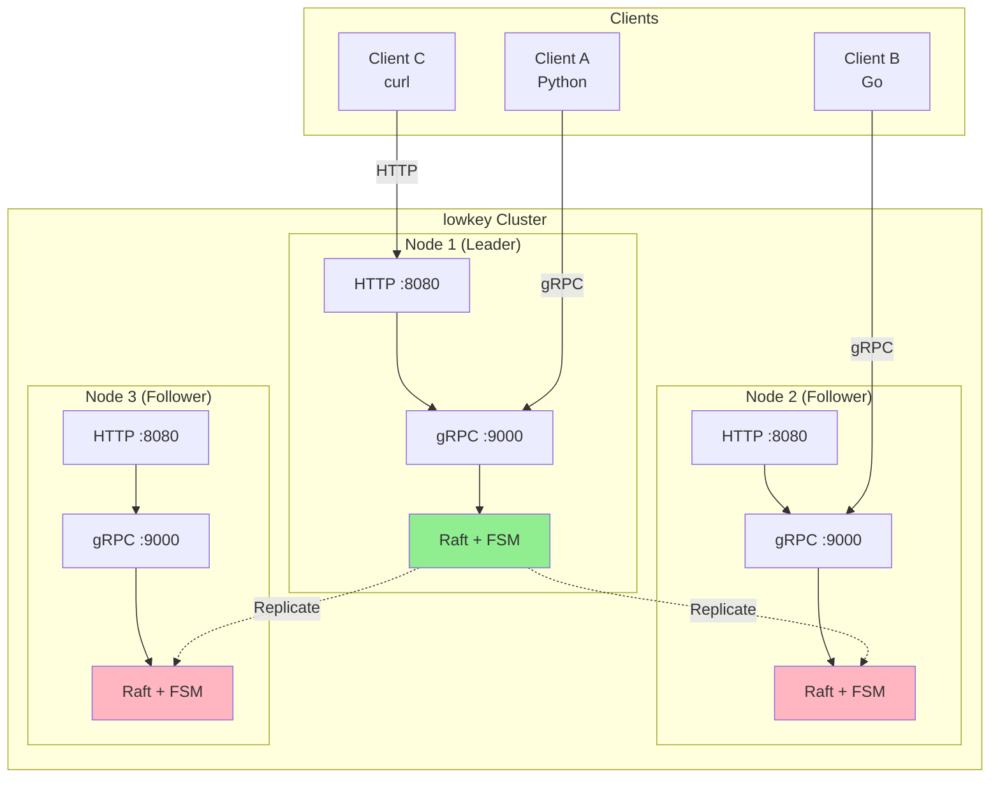
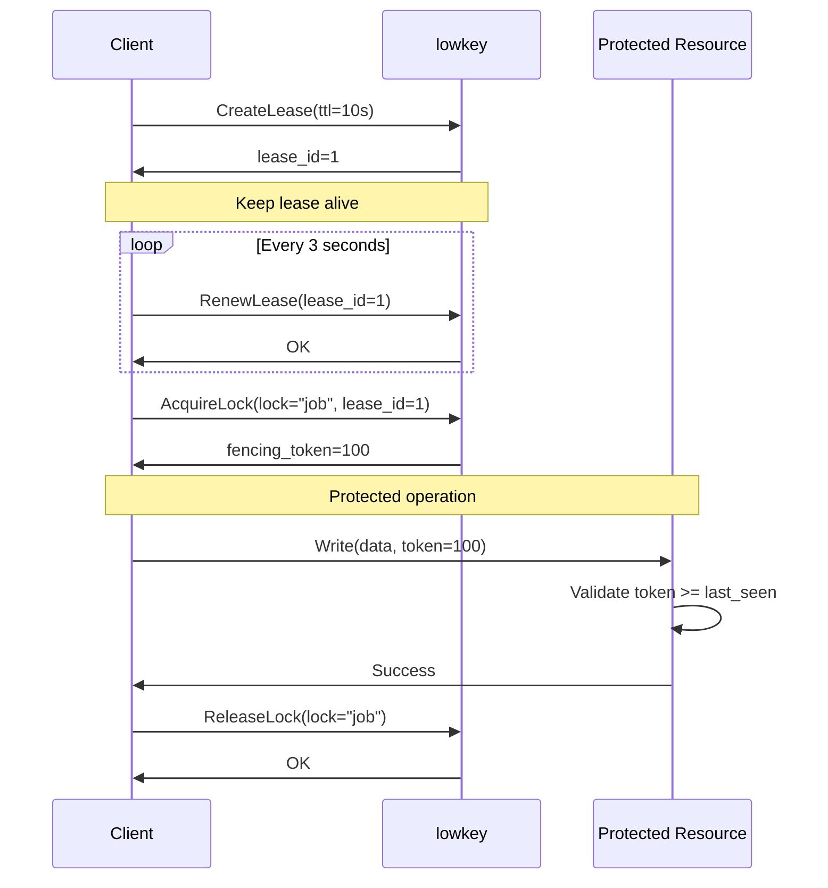
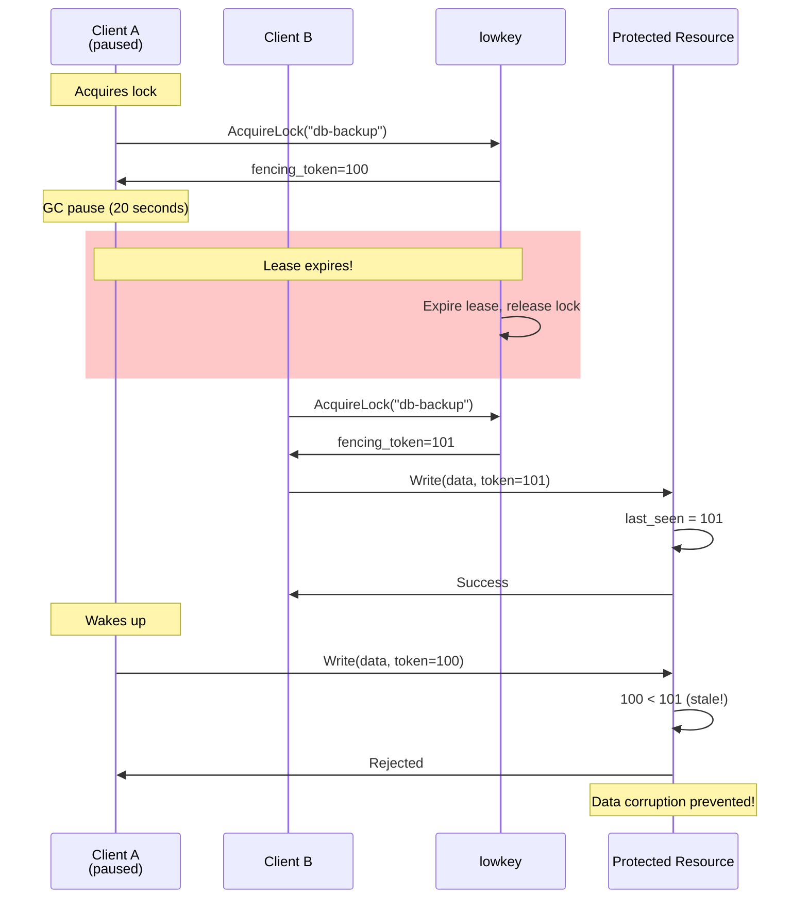
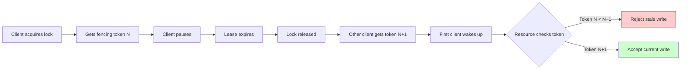

# lowkey

> A distributed lock service built on Raft consensus - simple, correct, and production-ready.

**lowkey** provides distributed locks with fencing tokens to prevent split-brain scenarios. Built on [Raft consensus](https://raft.github.io/), it guarantees strong consistency and handles network partitions gracefully.

## Features

- **Distributed Locks** - Mutual exclusion across multiple machines
- **Fencing Tokens** - Monotonically increasing tokens prevent stale writes
- **Lease-based** - Automatic lock release on client failure
- **Raft Consensus** - Strong consistency, no split-brain
- **Dual API** - gRPC (streaming) + HTTP REST (polling)
- **Production Ready** - Persistent storage, snapshots, leader election

---

## Architecture



---

## Quick Start

### Installation

```bash
git clone https://github.com/pixperk/lowkey.git
cd lowkey
go build -o lowkey cmd/lowkey/main.go
```

### Start a Single Node

```bash
./lowkey --bootstrap --data-dir ./data
```

### Use the HTTP API

```bash
# Create a lease (client heartbeat)
curl -X POST http://localhost:8080/v1/lease \
  -H "Content-Type: application/json" \
  -d '{"owner_id":"client-1","ttl_seconds":10}'
# Response: {"leaseId":"1","ttlSeconds":"10"}

# Acquire a lock
curl -X POST http://localhost:8080/v1/lock/acquire \
  -H "Content-Type: application/json" \
  -d '{"lock_name":"my-job","owner_id":"client-1","lease_id":1}'
# Response: {"fencingToken":"1","leaseTtlSeconds":"10"}

# Use the fencing token to protect critical operations
# (Your application must validate tokens!)

# Release the lock
curl -X POST http://localhost:8080/v1/lock/release \
  -H "Content-Type: application/json" \
  -d '{"lock_name":"my-job","lease_id":1}'
# Response: {"released":true}
```

---

## Core Concepts

### Lock Lifecycle



### Fencing Tokens Prevent Stale Writes



**Key insight:** The fencing token ensures even if a client holds a stale lock, the protected resource will reject its operations.

---

## API Reference

### HTTP REST API

#### Lease Operations

| Endpoint | Method | Description |
|----------|--------|-------------|
| `/v1/lease` | POST | Create a new lease |
| `/v1/lease/renew` | POST | Renew an existing lease |

#### Lock Operations

| Endpoint | Method | Description |
|----------|--------|-------------|
| `/v1/lock/acquire` | POST | Acquire a lock (returns fencing token) |
| `/v1/lock/release` | POST | Release a lock |

#### Cluster Status

| Endpoint | Method | Description |
|----------|--------|-------------|
| `/v1/status` | GET | Get cluster status and statistics |

### gRPC API

For high-performance clients, use the gRPC API with bidirectional streaming for efficient lease renewal:

```protobuf
service LockService {
    rpc CreateLease(CreateLeaseRequest) returns (CreateLeaseResponse);
    rpc RenewLease(RenewLeaseRequest) returns (RenewLeaseResponse);
    rpc Heartbeat(stream HeartbeatRequest) returns (stream HeartbeatResponse);
    rpc AcquireLock(AcquireLockRequest) returns (AcquireLockResponse);
    rpc ReleaseLock(ReleaseLockRequest) returns (ReleaseLockResponse);
    rpc GetStatus(GetStatusRequest) returns (GetStatusResponse);
}
```

---

## Usage Patterns

### Pattern 1: Singleton Job

Ensure only one instance of a job runs across your cluster:

```bash
# Instance 1
LEASE=$(curl -s -X POST http://localhost:8080/v1/lease \
  -d '{"owner_id":"worker-1","ttl_seconds":60}' | jq -r .leaseId)

LOCK=$(curl -s -X POST http://localhost:8080/v1/lock/acquire \
  -d "{\"lock_name\":\"daily-report\",\"owner_id\":\"worker-1\",\"lease_id\":$LEASE}")

if [ $? -eq 0 ]; then
    TOKEN=$(echo $LOCK | jq -r .fencingToken)
    echo "Running job with token $TOKEN"
    # Run your job here
    ./run-daily-report.sh --token $TOKEN
fi
```

### Pattern 2: Leader Election

```bash
# Each instance tries to acquire the "leader" lock
# Only one succeeds and becomes the leader
curl -X POST http://localhost:8080/v1/lock/acquire \
  -d '{"lock_name":"leader","owner_id":"'$(hostname)'","lease_id":'$LEASE_ID'}'
```

---

## Design Philosophy

### Why Raft?

- **Strong consistency** - No split-brain scenarios
- **Proven algorithm** - Well-understood failure modes
- **Leader-based** - Simple to reason about
- **Log replication** - Durable state machine

### Why NOT Redis Redlock?

Martin Kleppmann [explained it best](https://martin.kleppmann.com/2016/02/08/how-to-do-distributed-locking.html):

> "Redlock depends on timing assumptions... even if your clock is perfectly synchronized, the moment you cross a network boundary, all guarantees are off."

**lowkey uses:**
- Monotonic time (not wall clocks)
- Fencing tokens (not timeouts)
- Consensus (not independent nodes)

### Why Fencing Tokens?



**Without fencing tokens:** Timeouts alone can't prevent stale writes
**With fencing tokens:** Resources can detect and reject stale operations

---

## Configuration

### Command-line Flags

```bash
./lowkey \
  --node-id "node-1" \
  --raft-addr "127.0.0.1:7000" \
  --grpc-addr ":9000" \
  --http-addr ":8080" \
  --data-dir "./data" \
  --bootstrap
```

| Flag | Default | Description |
|------|---------|-------------|
| `--node-id` | (generated) | Unique node identifier (UUID) |
| `--raft-addr` | `127.0.0.1:7000` | Raft consensus bind address |
| `--grpc-addr` | `:9000` | gRPC server listen address |
| `--http-addr` | `:8080` | HTTP gateway listen address |
| `--data-dir` | `./data` | Data directory for Raft logs |
| `--bootstrap` | `false` | Bootstrap a new cluster |

---

## Running Tests

```bash
# Unit tests
go test ./pkg/... -v

# Integration tests
go test ./test/integration/... -v

# Coverage
go test ./... -coverprofile=coverage.out
go tool cover -html=coverage.out
```

---

## Comparison

| Feature | lowkey | etcd | Consul | Redis Redlock | ZooKeeper |
|---------|--------|------|--------|---------------|-----------|
| Consensus | Raft | Raft | Raft | None | ZAB (Paxos-like) |
| Fencing Tokens | Yes | Yes | No | No | Yes (via versions) |
| Lease-based | Yes | Yes | Yes | No | Yes (sessions) |
| HTTP API | Yes | Yes | Yes | No | No |
| gRPC API | Yes | Yes | Yes | No | No |
| Focus | Locks only | KV store + locks | Service discovery | Cache | Coordination |

---

## Resources

- [How to do distributed locking](https://martin.kleppmann.com/2016/02/08/how-to-do-distributed-locking.html) - Martin Kleppmann
- [Google Chubby Paper](https://research.google/pubs/pub27897/)
- [Raft Consensus Algorithm](https://raft.github.io/)
- [etcd Lock Implementation](https://github.com/etcd-io/etcd/tree/main/client/v3/concurrency)

---

## Contributing

Contributions welcome! Please read the contributing guidelines first.

---

## License

MIT License - see LICENSE file for details

---

## Acknowledgments

Built with:
- [hashicorp/raft](https://github.com/hashicorp/raft) - Raft consensus implementation
- [grpc-ecosystem/grpc-gateway](https://github.com/grpc-ecosystem/grpc-gateway) - HTTP/gRPC translation
- [bbolt](https://github.com/etcd-io/bbolt) - Persistent storage

Inspired by:
- Google Chubby
- etcd
- Apache ZooKeeper

---

**Remember:** This is not about building the fastest lock. This is about building a *correct* lock that won't eat your data when clocks drift, networks partition, and processes pause.
