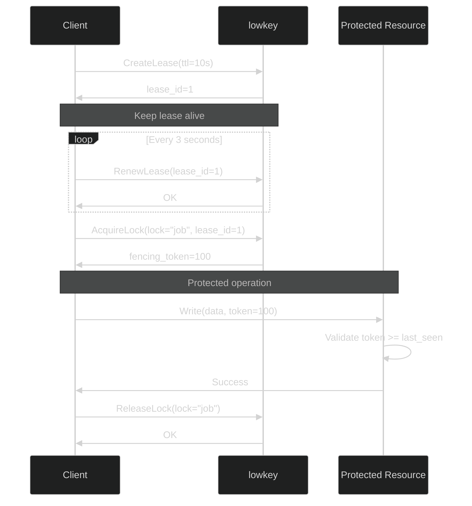
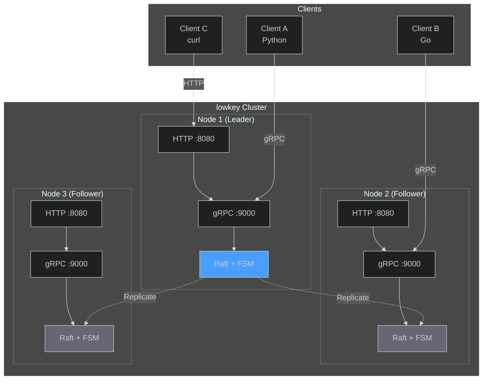

# lowkey

<div align="center">

**Distributed locking with Raft consensus and fencing tokens**

[](https://golang.org)
[](LICENSE)
[](https://raft.github.io/)

*Strong consistency for distributed mutual exclusion*

[Quick Start](#quick-start) • [Go SDK](#go-sdk) • [Examples](#production-examples) • [API](#api-reference)

</div>

---

## Overview

**lowkey** is a distributed lock service built on Raft consensus. It provides strongly consistent locks with fencing tokens to prevent split-brain scenarios and stale writes.

**Use cases:**
- Distributed cron jobs (only one instance executes)
- Database migrations (ensure single execution)
- Leader election
- Critical section protection across multiple processes

**Core guarantees:**
- **Strong consistency** - CP in CAP theorem, no split-brain under network partitions
- **Fencing tokens** - Monotonically increasing counters prevent stale writes
- **Automatic cleanup** - Lease-based locks release automatically on client failure

---

## Why lowkey?

**The problem with naive locking:**

Multiple service instances need to coordinate. You add a distributed lock. But:
- Networks partition → multiple "leaders"
- Processes pause (GC, CPU) → stale lock holders
- Clients crash → locks held forever

**How lowkey solves it:**

1. **Raft consensus** → Only majority partition can acquire locks
2. **Fencing tokens** → Resources reject operations from stale lock holders
3. **Leases** → Locks auto-release when clients stop heartbeating

**Comparison with alternatives:**

| System | Consensus | Fencing Tokens | Split-brain Protection |
|--------|-----------|----------------|----------------------|
| **lowkey** | Raft | ✓ | ✓ |
| etcd | Raft | ✓ | ✓ |
| Consul | Raft | ✗ | ✓ |
| Redis Redlock | None | ✗ | ✗ |

---

## Quick Start

### Installation

```bash
git clone https://github.com/pixperk/lowkey.git
cd lowkey
go build -o lowkey cmd/lowkey/main.go
```

### Single Node (Development)

```bash
# Start server
./lowkey --bootstrap --data-dir ./data

# Server running on:
# - gRPC: :9000
# - HTTP: :8080
```

### HTTP API Example

```bash
# Create lease (60 second TTL)
curl -X POST http://localhost:8080/v1/lease \
  -d '{"owner_id":"client-1","ttl_seconds":60}'
# Response: {"lease_id":1}

# Acquire lock
curl -X POST http://localhost:8080/v1/lock/acquire \
  -d '{"lock_name":"my-job","owner_id":"client-1","lease_id":1}'
# Response: {"fencing_token":1}

# Release lock
curl -X POST http://localhost:8080/v1/lock/release \
  -d '{"lock_name":"my-job","lease_id":1}'
```

---

## Go SDK

### Installation

```bash
go get github.com/pixperk/lowkey/pkg/client
```

### Basic Usage

```go
package main

import (
    "context"
    "log"
    "time"

    "github.com/pixperk/lowkey/pkg/client"
)

func main() {
    // Connect to lowkey
    c, err := client.NewClient("localhost:9000", "worker-1")
    if err != nil {
        log.Fatal(err)
    }
    defer c.Stop()

    // Create lease with automatic renewal
    ctx := context.Background()
    if err := c.Start(ctx, 10*time.Second); err != nil {
        log.Fatal(err)
    }

    // Acquire lock (returns fencing token)
    lock, err := c.Acquire(ctx, "my-job")
    if err != nil {
        log.Printf("Lock held by another instance: %v", err)
        return
    }
    defer lock.Release(ctx)

    token := lock.Token()
    log.Printf("Acquired lock with fencing token %d", token)

    // Use token in protected operations
    database.ExecuteWithToken(ctx, token, func() {
        // Critical section - only one instance executes this
    })
}
```

### SDK Reference

**Client API:**

| Method | Description |
|--------|-------------|
| `NewClient(addr, ownerID)` | Create client connection to lowkey server |
| `Start(ctx, ttl)` | Create lease with automatic heartbeat (renews every TTL/3) |
| `Acquire(ctx, lockName)` | Acquire lock, returns `*Lock` with fencing token |
| `Release(ctx, lockName)` | Release lock explicitly |
| `Status(ctx)` | Get cluster status and metrics |
| `Stop()` | Stop heartbeat goroutine and close connection |

**Lock API:**

| Method | Description |
|--------|-------------|
| `Token()` | Get fencing token for this lock |
| `Release(ctx)` | Release this lock |

**Key behaviors:**
- Automatic heartbeats every TTL/3 via gRPC streaming
- Thread-safe for concurrent use
- Locks auto-release when lease expires
- Uses bidirectional gRPC streaming (more efficient than HTTP polling)

---

## Production Examples

### Using Fencing Tokens with Redis

Protect Redis operations by storing the fencing token alongside your data:

```go
import (
    "context"
    "fmt"
    "github.com/pixperk/lowkey/pkg/client"
    "github.com/redis/go-redis/v9"
)

func processJob(ctx context.Context, lockClient *client.Client, redisClient *redis.Client) error {
    // Acquire lock
    lock, err := lockClient.Acquire(ctx, "daily-report")
    if err != nil {
        return fmt.Errorf("lock held by another instance: %w", err)
    }
    defer lock.Release(ctx)

    token := lock.Token()

    // Check if we have a stale token
    storedToken, _ := redisClient.Get(ctx, "daily-report:token").Uint64()
    if token < storedToken {
        return fmt.Errorf("stale token %d < %d, aborting", token, storedToken)
    }

    // Perform protected operation with token validation
    pipe := redisClient.TxPipeline()
    pipe.Set(ctx, "daily-report:token", token, 0)
    pipe.Set(ctx, "daily-report:data", "report-content", 0)

    _, err = pipe.Exec(ctx)
    return err
}
```

**Key insight:** Even if a paused client wakes up with an expired lock, Redis will reject the write because `token < storedToken`.

### Using Fencing Tokens with Postgres

Store the fencing token in a dedicated column and use conditional updates:

```sql
CREATE TABLE jobs (
    name TEXT PRIMARY KEY,
    last_run TIMESTAMP,
    last_token BIGINT NOT NULL DEFAULT 0
);
```

```go
import (
    "context"
    "database/sql"
    "github.com/pixperk/lowkey/pkg/client"
)

func runDatabaseJob(ctx context.Context, lockClient *client.Client, db *sql.DB) error {
    lock, err := lockClient.Acquire(ctx, "db-migration")
    if err != nil {
        return err
    }
    defer lock.Release(ctx)

    token := lock.Token()

    // Conditional update: only succeed if our token is newer
    result, err := db.ExecContext(ctx, `
        UPDATE jobs
        SET last_run = NOW(), last_token = $1
        WHERE name = $2 AND last_token < $1
    `, token, "db-migration")

    if err != nil {
        return err
    }

    rows, _ := result.RowsAffected()
    if rows == 0 {
        return fmt.Errorf("stale token, another instance already ran")
    }

    // Safe to proceed - we have the freshest token
    return runMigration(ctx, db)
}
```

### Using Fencing Tokens with S3

Prevent split-brain writes to object storage:

```go
func uploadWithToken(ctx context.Context, lockClient *client.Client, s3Client *s3.Client) error {
    lock, err := lockClient.Acquire(ctx, "backup-upload")
    if err != nil {
        return err
    }
    defer lock.Release(ctx)

    token := lock.Token()

    // First, check the current token in metadata
    head, err := s3Client.HeadObject(ctx, &s3.HeadObjectInput{
        Bucket: aws.String("backups"),
        Key:    aws.String("latest.tar.gz"),
    })

    if err == nil {
        storedToken, _ := strconv.ParseUint(head.Metadata["Fencing-Token"], 10, 64)
        if token <= storedToken {
            return fmt.Errorf("stale token, aborting upload")
        }
    }

    // Upload with token in metadata
    _, err = s3Client.PutObject(ctx, &s3.PutObjectInput{
        Bucket: aws.String("backups"),
        Key:    aws.String("latest.tar.gz"),
        Body:   data,
        Metadata: map[string]string{
            "Fencing-Token": fmt.Sprintf("%d", token),
        },
    })

    return err
}
```

**Pattern:** Always include the fencing token with your write operations. The protected resource validates `new_token > stored_token` before accepting writes.

---

## Deployment

### Single Node (Development)

```bash
./lowkey --bootstrap --data-dir ./data
```

### Multi-Node Cluster

**Node 1 (Bootstrap):**
```bash
./lowkey \
  --node-id node-1 \
  --raft-addr 10.0.1.1:7000 \
  --grpc-addr :9000 \
  --http-addr :8080 \
  --data-dir /var/lib/lowkey \
  --bootstrap
```

**Node 2:**
```bash
./lowkey \
  --node-id node-2 \
  --raft-addr 10.0.1.2:7000 \
  --grpc-addr :9000 \
  --http-addr :8080 \
  --data-dir /var/lib/lowkey \
  --join 10.0.1.1:7000
```

**Node 3:**
```bash
./lowkey \
  --node-id node-3 \
  --raft-addr 10.0.1.3:7000 \
  --grpc-addr :9000 \
  --http-addr :8080 \
  --data-dir /var/lib/lowkey \
  --join 10.0.1.1:7000
```

### Configuration Flags

| Flag | Default | Description |
|------|---------|-------------|
| `--node-id` | (generated UUID) | Unique node identifier |
| `--raft-addr` | `127.0.0.1:7000` | Raft consensus bind address |
| `--grpc-addr` | `:9000` | gRPC server listen address |
| `--http-addr` | `:8080` | HTTP gateway listen address |
| `--data-dir` | `./data` | Data directory for Raft logs and snapshots |
| `--bootstrap` | `false` | Bootstrap a new cluster (first node only) |
| `--join` | `""` | Join existing cluster (address of any existing node) |

### Cluster Operations

**Check cluster status:**
```bash
curl http://localhost:8080/v1/status
```

**Response:**
```json
{
  "node_id": "node-1",
  "is_leader": true,
  "leader_addr": "10.0.1.1:7000",
  "cluster_size": 3
}
```

---

## How It Works

### Lock Lifecycle



### Fencing Tokens Prevent Stale Writes

```mermaid
%%{init: {'theme':'dark'}}%%
sequenceDiagram
    participant A as Client A<br/>(paused)
    participant B as Client B
    participant L as lowkey
    participant R as Protected Resource

    A->>L: AcquireLock("db-backup")
    L->>A: fencing_token=100

    Note over A: GC pause (20s)
    rect rgb(80, 40, 40)
        Note over A,L: Lease expires!
        L->>L: Release lock
    end

    B->>L: AcquireLock("db-backup")
    L->>B: fencing_token=101

    B->>R: Write(data, token=101)
    R->>R: last_seen = 101
    R->>B: Success

    Note over A: Wakes up
    A->>R: Write(data, token=100)
    R->>R: 100 < 101 (stale!)
    R->>A: Rejected
```



**Key insight:** The fencing token ensures even if a client holds a stale lock, the protected resource will reject its operations.

### Architecture



---

## API Reference

### HTTP REST API

| Endpoint | Method | Description |
|----------|--------|-------------|
| `/v1/lease` | POST | Create a new lease |
| `/v1/lease/renew` | POST | Renew an existing lease (polling) |
| `/v1/lock/acquire` | POST | Acquire a lock (returns fencing token) |
| `/v1/lock/release` | POST | Release a lock |
| `/v1/status` | GET | Get cluster status and statistics |

### gRPC API

```protobuf
service LockService {
    rpc CreateLease(CreateLeaseRequest) returns (CreateLeaseResponse);
    rpc RenewLease(RenewLeaseRequest) returns (RenewLeaseResponse);
    rpc Heartbeat(stream HeartbeatRequest) returns (stream HeartbeatResponse);
    rpc AcquireLock(AcquireLockRequest) returns (AcquireLockResponse);
    rpc ReleaseLock(ReleaseLockRequest) returns (ReleaseLockResponse);
    rpc GetStatus(GetStatusRequest) returns (GetStatusResponse);
}
```

**Note:** HTTP clients poll `/v1/lease/renew`, gRPC clients use `Heartbeat` stream for efficiency.

---

## Performance

### Benchmarks

Using Go's built-in benchmark framework:

```bash
# Throughput benchmarks
make bench-all

# Individual scenarios
make bench-sequential   # Single client baseline
make bench-parallel     # Multiple clients, unique locks
make bench-contention   # Multiple clients competing

# Latency percentiles (p50, p90, p99, p99.9)
make bench-percentiles
```

**Throughput Results** (AMD Ryzen 7 5800HS, 16 cores):

| Benchmark | Operations | Latency/op | Scenario |
|-----------|-----------|------------|----------|
| Sequential | 4,460 | 3.24ms | Single client, measures Raft consensus overhead |
| Parallel | 19,911 | 0.60ms | Multiple clients, unique locks (true throughput) |
| Contention | 10,000 | 1.40ms | Multiple clients competing for same lock |

**Latency Percentiles** (1000 samples each):

| Scenario | p50 | p90 | p99 | p99.9 |
|----------|-----|-----|-----|-------|
| Sequential | 2.5ms | 2.7ms | 3.1ms | 6.5ms |
| Parallel | 4.4ms | 5.5ms | 7.0ms | 25ms |
| Contention | 5.5ms | 6.5ms | 7.6ms | 7.6ms |

**Key insights:**
- **Consistent latency** - p99 is only ~2ms slower than p50 (no wild outliers)
- **Sub-10ms p99** - 99% of locks acquired in under 10ms even with contention
- Heartbeats bypass Raft (leader-only renewal) → minimal overhead
- Lock acquire/release through Raft → strong consistency
- Parallel throughput 5.4x faster than sequential

### Testing

```bash
# Unit tests
make test

# Coverage report
make test-coverage
```

---

## Technical Details

### Core Components

**Raft Consensus Layer:**
- HashiCorp Raft implementation
- Leader election and log replication
- Persistent storage with BoltDB
- Automatic snapshots

**Finite State Machine (FSM):**
- Lease management with monotonic time
- Lock acquisition with fencing tokens
- Automatic cleanup on lease expiration

**Dual API:**
- gRPC with bidirectional streaming (efficient heartbeats)
- HTTP REST with JSON (easy integration)
- gRPC-Gateway for HTTP→gRPC translation

### Why This Design?

**Raft Consensus:**
- Proven algorithm with well-understood failure modes
- CP in CAP theorem (consistency over availability)
- No split-brain under network partitions

**Fencing Tokens:**
- Monotonically increasing counters
- Mathematical guarantee against stale writes
- Protected resources validate tokens

**Lease-based Locks:**
- Automatic cleanup when clients crash
- No manual intervention required
- Configurable TTL per client

---

## Resources

### Papers and Articles

- [How to do distributed locking](https://martin.kleppmann.com/2016/02/08/how-to-do-distributed-locking.html) - Martin Kleppmann
- [The Chubby lock service for loosely-coupled distributed systems](https://research.google/pubs/pub27897/) - Google Research
- [In Search of an Understandable Consensus Algorithm](https://raft.github.io/raft.pdf) - Raft Paper

### Implementations

- [etcd](https://github.com/etcd-io/etcd) - Distributed KV store with locks
- [Consul](https://github.com/hashicorp/consul) - Service mesh with distributed locks
- [Chubby](https://research.google/pubs/pub27897/) - Google's distributed lock service

---

## Built With

- [hashicorp/raft](https://github.com/hashicorp/raft) - Battle-tested Raft consensus implementation
- [grpc-ecosystem/grpc-gateway](https://github.com/grpc-ecosystem/grpc-gateway) - HTTP/gRPC bidirectional translation
- [bbolt](https://github.com/etcd-io/bbolt) - Embedded key-value database for persistent storage
- [protobuf](https://protobuf.dev/) - Protocol Buffers for efficient serialization

---

## License

MIT License - see [LICENSE](LICENSE) for details

---

## Contributing

Contributions welcome! Please open an issue or submit a pull request.

**Areas for contribution:**
- Client libraries for other languages (Python, Rust, Java)
- Observability (Prometheus metrics, structured logging)
- Integration tests and chaos engineering
- Documentation and examples
